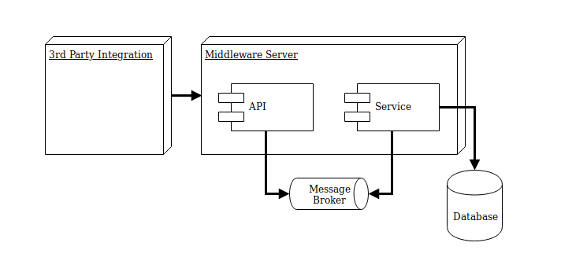

# Blue Belt Exercises

Solve and test the issues of this project without configuring your local environment.



## Setup

1. Create a test project
2. Add your favorite test technologies

## Exercise

Error reports show many invalid CPFs received from ther 3rd party.

Validate the CPF format using unit testing, and if invalid, record it to an error handling table instead of saving the Invoice.

## Testing

```s
dotnet restore
dotnet test
```

### Integrated

**RabbitMQ**

```s
# Management user/pass is "guest/guest"
sudo docker run -d --hostname dojo-rabbit --name dojo-rabbit -p 5672:5672 -p 15672:15672 rabbitmq:3-management
```