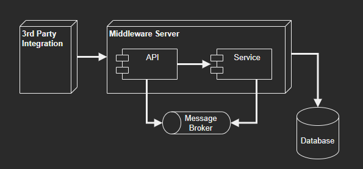

# Blue Belt Exercises

Solve and test the issues of this project without configuring your local environment.



## Setup

1. Create a test project
2. Add your favorite test technologies

## Issues

- Find and solve the problem in CPF validation
- Find and solve the problem in data persistence

## Testing

```s
dotnet restore
dotnet test
```