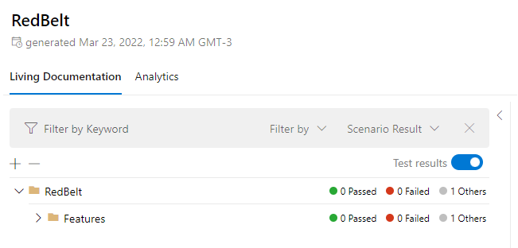

# Red Best Exercise

BDD Testing with SpecFlow.



### Running it

Install the required dependencies:

```sh
dotnet new -i SpecFlow.Templates.DotNet
dotnet tool install --global SpecFlow.Plus.LivingDoc.CLI
```

Run the testes to generate the code:

```sh
dotnet restore
dotnet test
```

Generate the living doc:

```sh
cd bin/Debug/net6.0
livingdoc test-assembly RedBelt.dll -t TestExecution.json
```

The file will be available at: `bin/Debug/net6.0/LivingDoc.html`

### Sources

```
https://docs.specflow.org/projects/specflow/en/latest/Installation/Project-and-Item-Templates.html#creating-a-new-project-from-the-template
https://docs.specflow.org/projects/specflow-livingdoc/en/latest/sbsguides/sbscli.html
```